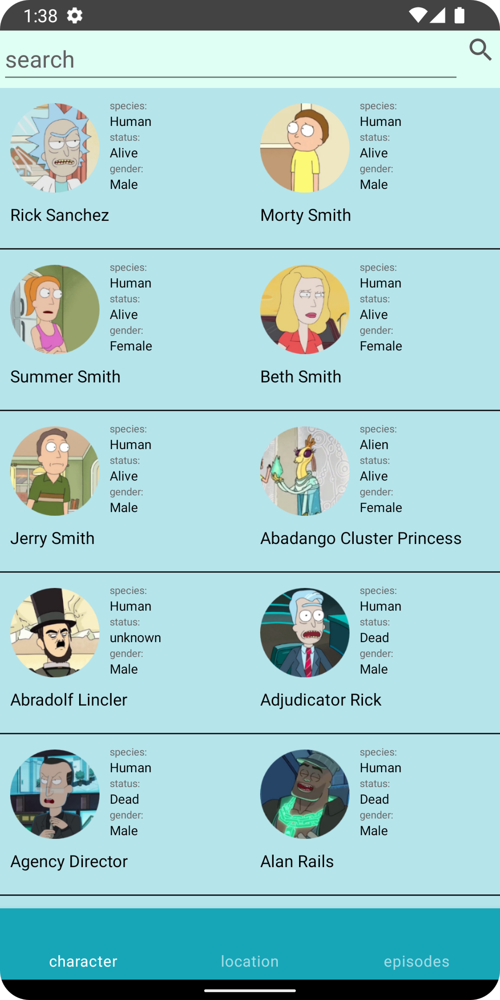
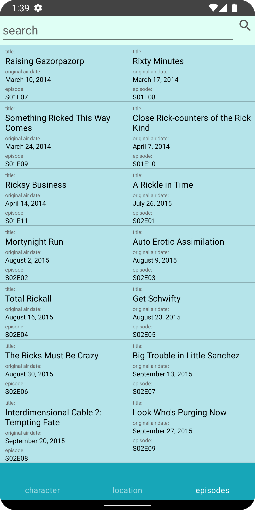
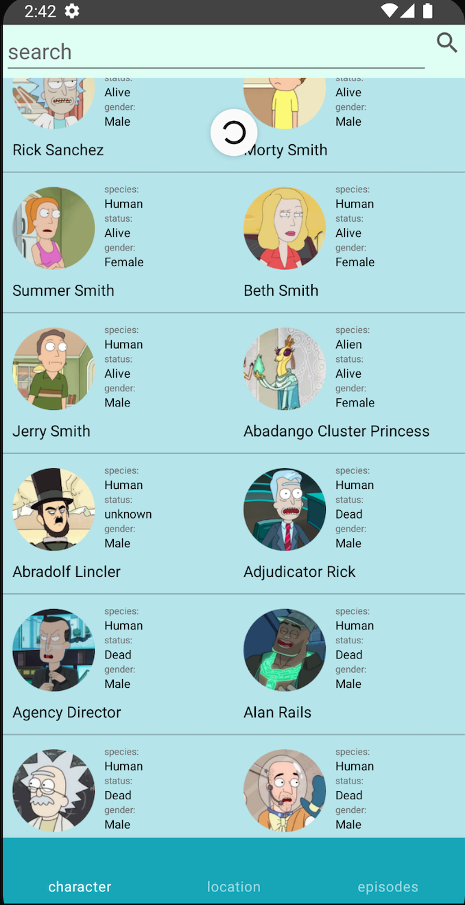
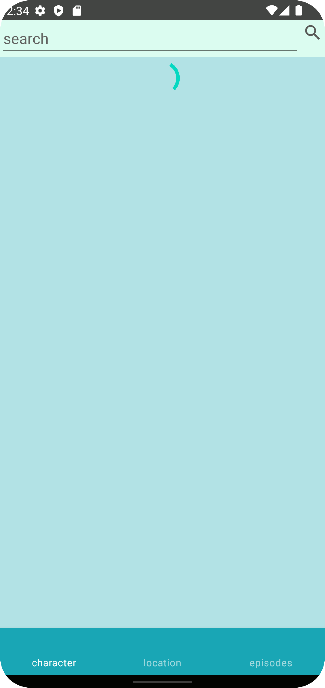

# RickAndMorty
Приложение для Android по мультсериалу Rick and Morty, в работе использованы API 🔗 (https://rickandmortyapi.com/). В проекте реализован MVVM, clean architecture, Coroutines, Retrofit.
# Splash screens

# Основной экран
На основном экране реализованы списки всех персонажей, локаций, эпизодов в виде таблицы с 2 столбцами. Навигация по спискам осуществялется при помощи bottomNavigation.
 
#Детализация списков

#Можно узнать о вариантах всех любимых персонажей, воспользоваавшись поиском по списку.

#Pull-to-Refresh/ProgressBar
 
#Кэширование
Приложение поддерживает кеширование и имеет возможность работать без интернета.
